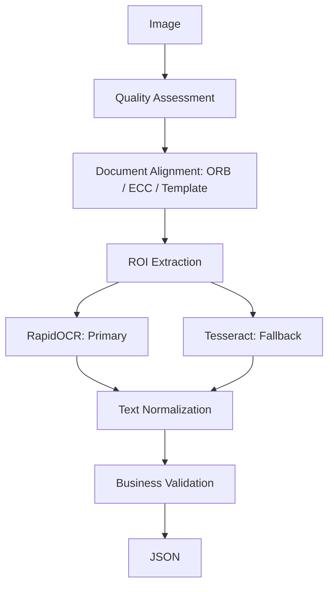

# Tiny VN OCR

**Hệ thống OCR trích xuất thông tin giấy tờ tùy thân trên thiết bị tài nguyên hạn chế**

## 1. Tổng quan bài toán

### Mục tiêu
Xây dựng hệ thống tự động trích xuất thông tin từ ảnh giấy tờ tùy thân (CCCD, GPLX, Các loại giấy tờ định danh khác).

**Input:**
- Ảnh chụp bằng điện thoại
- Đã crop sẵn vùng giấy tờ
- Có thể gặp: ảnh mờ, lệch góc, ánh sáng không đều, bóng phản chiếu, nhiễu camera

**Output (Unified Schema):**
Thay vì mỗi loại giấy tờ một format, hệ thống sử dụng chung một cấu trúc:
```json
{
  "document_type": "cccd",
  "confidence": 0.96,
  "fields": {
    "identity": {
      "full_name": "",
      "date_of_birth": "",
      "id_number": ""
    },
    "vehicle": {
      "license_plate": "",
      "engine_number": "",
      "chassis_number": ""
    },
    "license": {
      "license_class": "",
      "license_number": ""
    }
  },
  "metadata": {
    "ocr_engine": "rapidocr",
    "processing_time_ms": 350
  }
}
```

### Chi tiết các loại giấy tờ hỗ trợ

#### 1. CCCD Việt Nam (Căn cước công dân)
CCCD hiện nay có các thông tin chính như số định danh cá nhân 12 số, họ tên, ngày sinh, giới tính, quốc tịch, quê quán, nơi cư trú, ngày cấp...

**Suggested Schema:**
```json
{
  "document_type": "cccd",
  "fields": {
    "id_number": "079123456789",
    "full_name": "NGUYEN VAN A",
    "date_of_birth": "01/01/1995",
    "gender": "NAM",
    "nationality": "VIET NAM",
    "place_of_origin": "TP HO CHI MINH",
    "place_of_residence": "QUAN 1 TP HO CHI MINH",
    "date_of_issue": "01/01/2022"
  }
}
```

**ROI Template Example (cccd_front):**
```yaml
cccd_front:
  id_number:
    type: number
    validation:
      length: 12
  full_name:
    type: text
  date_of_birth:
    type: date
  gender:
    type: enum
    values:
      - NAM
      - NU
  nationality:
    type: text
```

#### 2. Giấy phép lái xe (GPLX)
GPLX PET thường có các thông tin: Họ tên, Ngày sinh, Quốc tịch, Số GPLX, Hạng giấy phép, Ngày cấp, Ngày hết hạn (nếu có), Nơi cấp...

**Suggested Schema:**
```json
{
  "document_type": "driving_license",
  "fields": {
    "license_number": "790123456789",
    "full_name": "NGUYEN VAN A",
    "date_of_birth": "01/01/1995",
    "nationality": "VIET NAM",
    "license_class": "A1",
    "date_of_issue": "10/05/2020",
    "date_of_expiry": null
  }
}
```

**ROI Template Example (gplx_front):**
```yaml
gplx_front:
  license_number:
    type: number
  full_name:
    type: text
  date_of_birth:
    type: date
  license_class:
    type: enum
    values:
      - A1
      - A
      - B1
      - B2
      - C
      - D
  issue_date:
    type: date
```

#### 3. Giấy chứng nhận đăng ký xe máy (cà vẹt xe)
Giấy đăng ký xe thường có các nhóm thông tin về chủ xe và phương tiện, số máy, số khung...

**Suggested Schema:**
```json
{
  "document_type": "vehicle_registration",
  "fields": {
    "license_plate": "59A3-12345",
    "owner_name": "NGUYEN VAN A",
    "owner_address": "QUAN 1 TP HCM",
    "brand": "HONDA",
    "model": "VISION",
    "color": "DEN",
    "engine_number": "JF86E1234567",
    "chassis_number": "RLHJF5800NY123456",
    "vehicle_type": "XE MAY",
    "date_of_issue": "01/01/2023"
  }
}
```

**Constraint (Ràng buộc):**
- RAM: ~2GB
- Không GPU
- Chạy local / edge device

## 2. OCR là gì?
OCR (Optical Character Recognition) là công nghệ chuyển đổi từ Hình ảnh chứa chữ sang Text có cấu trúc.

Ví dụ:
- Ảnh: `HỌ VÀ TÊN NGUYỄN VĂN A`
- OCR output: `HỌ VÀ TÊN: NGUYỄN VĂN A`

OCR gồm hai bước chính:
1. **Text Detection**: tìm vị trí chữ
2. **Text Recognition**: đọc nội dung chữ

## 3. Kiến trúc hệ thống đề xuất

**Pipeline tổng thể:**
`Image` -> `Quality Check` -> `Image Alignment (ORB/ECC/Template)` -> `ROI Extraction (crop từng field)` -> `OCR Engine` -> `Text Normalization` -> `Business Validation` -> `JSON Output`

## 4. Nguyên tắc quan trọng nhất
**Không OCR toàn bộ ảnh.**
Vì: nhiều nhiễu, OCR dễ nhầm, tốn CPU.

**Nên:** OCR từng vùng (ROI - Region of Interest).
Lợi ích: accuracy cao hơn, nhanh hơn, dễ validate.

## 5. Template-based Extraction
Với giấy tờ có layout cố định (CCCD, GPLX), không cần AI detect phức tạp.

**Cách làm:**
`Image` -> `Align về template chuẩn` -> `Crop vùng cố định` -> `OCR`

## 6. Image Alignment
**Mục tiêu:** Đưa ảnh chụp về cùng hệ tọa độ với template.

**Phương pháp (ORB + Homography):**
`Input Image` -> `ORB Feature Detection` -> `Feature Matching` -> `RANSAC Homography` -> `Warp Perspective`
- *Ưu điểm:* nhẹ, CPU friendly, có sẵn trong OpenCV.
- *Nhược điểm:* yếu khi ảnh quá blur hoặc thiếu texture.

**Fallback:** ECC alignment hoặc Contour Perspective Transform.

## 7. OCR Engine lựa chọn

### Option 1: RapidOCR / PP-OCR Mobile (Khuyến nghị cho production 2026)
- **Stack:** RapidOCR + ONNX Runtime + INT8 Quantization
- **Ưu điểm:** accuracy cao, xử lý tiếng Việt tốt, model nhẹ, chạy CPU.
- **RAM:** ~300-700MB peak.

### Option 2: Tesseract (Phù hợp cho MVP / thiết bị cực yếu)
- **Ưu điểm:** rất nhẹ, dễ deploy, không cần model lớn.
- **Nhược điểm:** kém hơn với ảnh camera, chữ nhỏ, tiếng Việt nhiều dấu.

**Vai trò:** RapidOCR (Primary OCR), Tesseract (Fallback).

## 8. Image Preprocessing
Ảnh camera cần xử lý trước OCR.

**Pipeline:**
`Original Image` -> `Grayscale` -> `Resize 2x` -> `Denoising` -> `Adaptive Threshold` -> `OCR`

- **Grayscale:** Giảm thông tin không cần thiết.
- **Resize:** Giúp OCR nhận diện chữ nhỏ tốt hơn.
- **Adaptive Threshold:** Xử lý bóng sáng, ánh sáng không đều.
- **Denoising:** Giảm noise camera.

## 9. OCR theo từng field
Mỗi field dùng config khác nhau.
- Tên: PSM 7 (single line)
- Số CCCD: PSM 7, Whitelist: `0123456789`
- Địa chỉ: PSM 6 (block text)

## 10. Post-processing và Validation
- **Normalize:** Sửa lỗi OCR phổ biến (VD: `0123S678901` -> `01235678901`, Mapping: `O->0, I->1, S->5`).
- **Regex Validation:** CCCD (length=12, only digit), Ngày sinh (dd/mm/yyyy).
- **Fuzzy Matching:** Sửa lỗi tên bằng Levenshtein Distance / TheFuzz (VD: `NGUYEN` -> `NGUYỄN`).

## 11. Kiến trúc Production đề xuất


## 12. Tech Stack đề xuất
**MVP:**
Python -> OpenCV, Tesseract, Regex, FastAPI

**Production:**
Python/C++ -> OpenCV + ONNX Runtime + RapidOCR + Validation Engine

## 13. Roadmap triển khai
- **Phase 1 - MVP:** Chạy được end-to-end (OpenCV + Template crop + Tesseract + Regex).
- **Phase 2 - Accuracy:** Upgrade lên RapidOCR, thêm alignment, multi preprocessing, confidence scoring.
- **Phase 3 - Production:** Thêm Docker light, FastAPI service, memory management, monitoring, retry pipeline.

## 14. Kết luận
**Giải pháp tối ưu cho bài toán:**
`Template-based Extraction` + `OpenCV Alignment` + `ROI OCR` + `RapidOCR (Primary)` + `Tesseract (Fallback)` + `Business Validation`

**Không nên sử dụng:** LLM Vision local, YOLO document detection, Transformer OCR nặng. Vì không phù hợp với thiết bị 2GB RAM, CPU-only, edge deployment.

**Triết lý chính:** Giảm bài toán AI lớn thành bài toán OCR có kiểm soát bằng template, ROI và validation nghiệp vụ.
